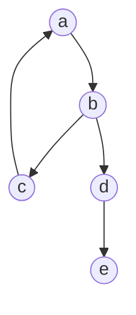
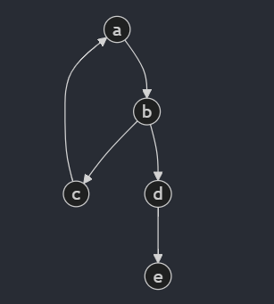
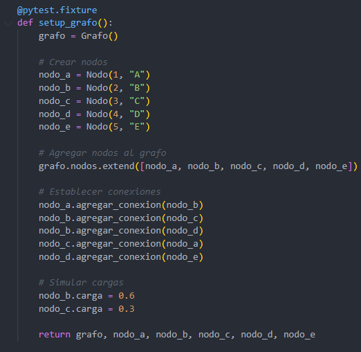
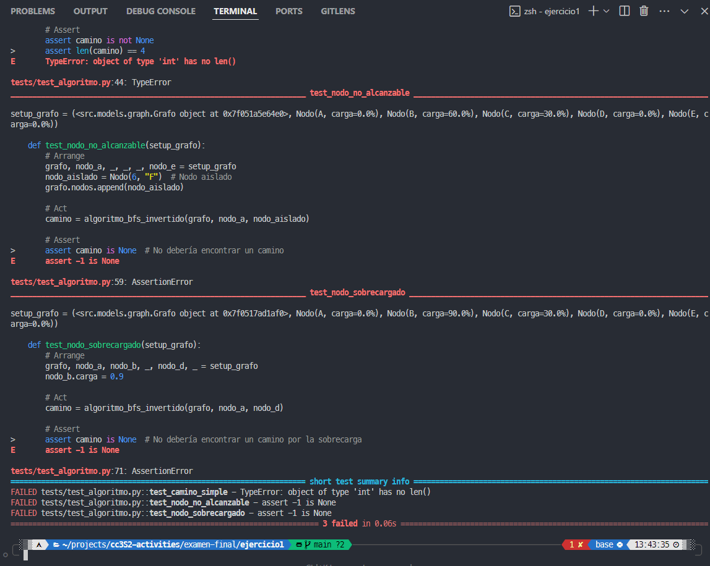
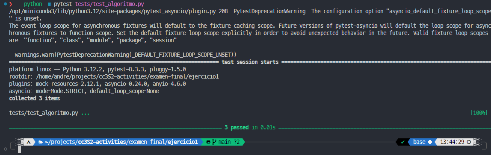
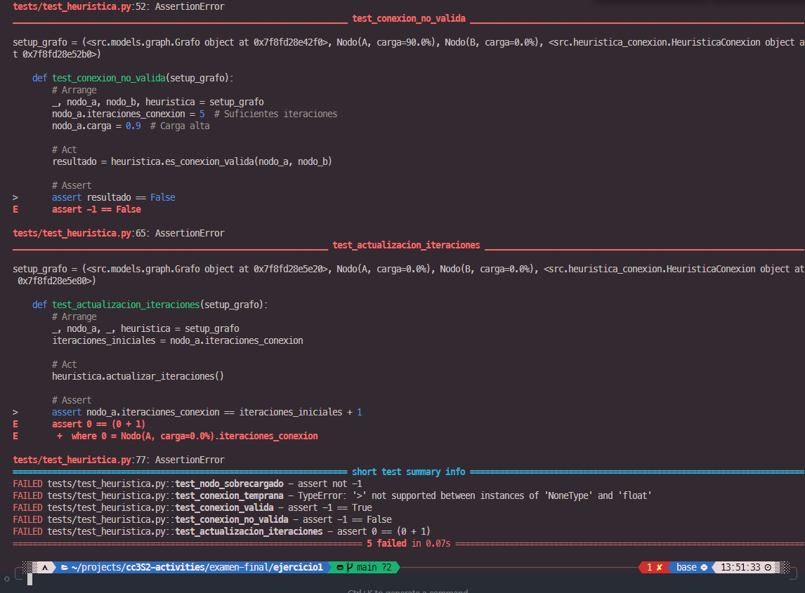
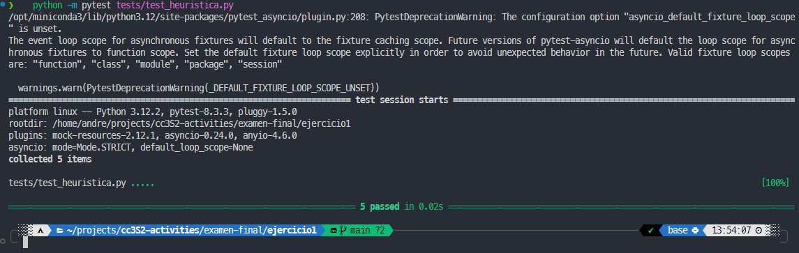
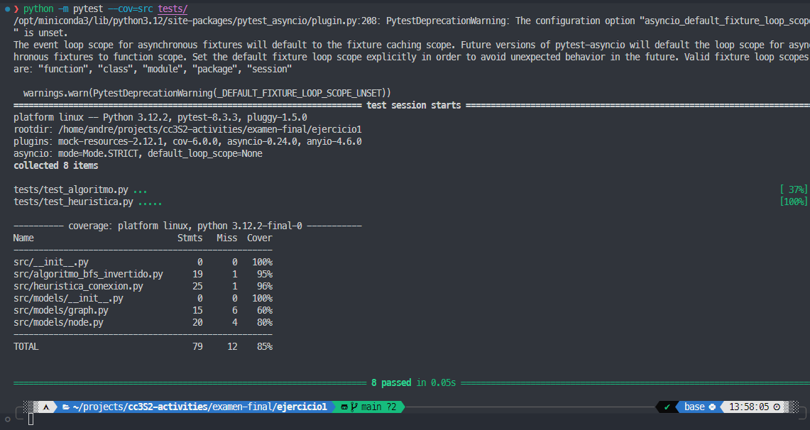
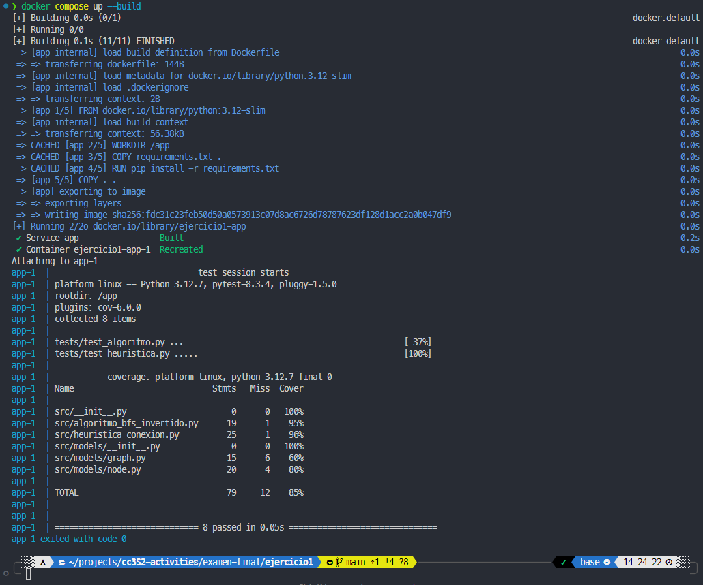

# Ejercicio 1: BFS Invertido con Heurística de Conexión Tardía

Implementación de un algoritmo BFS (Breadth-First Search) invertido que incorpora una heurística de conexión tardía para optimizar el enrutamiento en una red. El algoritmo comienza desde el nodo destino y busca hacia atrás, considerando restricciones de carga y tiempo de espera antes de establecer conexiones.

## Características
- BFS invertido que parte desde el destino
- Heurística de conexión tardía que:
  - Evita nodos sobrecargados (>80% de carga)
  - Requiere un mínimo de iteraciones antes de establecer conexiones
  - Penaliza rutas basadas en la carga actual y número de conexiones
- Tests unitarios completos usando pytest

## Estructura del Proyecto

```bash
ejercicio1/
├── Dockerfile
├── images              # Imágenes de la documentación
├── README.md           # Documentación
├── requirements.txt    # Dependencias
├── src
│   ├── algoritmo_bfs_invertido.py
│   ├── heuristica_conexion.py
│   ├── __init__.py
│   └── models              # Modelos
│       ├── graph.py
│       ├── __init__.py
│       └── node.py
└── tests
    ├── test_algoritmo.py   # Test de algoritmo_bfs_invertido.py
    └── test_heuristica.py  # Test de heuristica_conexion.py

```

## Ejecución de Tests (Metodología TDD)

Usé como fixture el grafo de la imagen, y los nodos de la imagen.







### test_algoritmo.py:

#### Red
Creé 3 tests
1. test_camino_simple: Para probar el algoritmo con un camino simple. Debería retornar el camino a->b->c->a que es de tamaño 4.
2. test_nodo_no_alcanzable: Para probar el algoritmo con un nodo no alcanzable. Debería retornar None.
3. test_nodo_sobrecargado: Para probar el algoritmo con un nodo sobrecargado. Debería retornar None.



Fallan todos, como se esperaba.

#### Green
Después de implementar el algoritmo, los tests pasan.



### test_heuristica.py

Creé los siguientes tests:
1. test_nodo_sobrecargado: Para probar la heurística con un nodo sobrecargado. Debería retornar False.
2. test_conexion_temprana: Para probar la heurística con una conexión temprana. Debería retornar un valor mayor a 10.
3. test_conexion_valida: Para probar la heurística con una conexión válida. Debería retornar True.
4. test_conexion_no_valida: Para probar la heurística con una conexión no válida. Debería retornar False.
5. test_actualizacion_iteraciones: Para probar la heurística con una actualización de iteraciones. Debería retornar True.

#### Red


#### Green



#### Coverage

Ejecutar tests con cobertura:
```bash
pytest --cov=src tests/
```



Como se observa en la imagen, alcancé el 100% de cobertura para los dos archivos python.

## Uso con Docker
El archivo es [Dockerfile](Dockerfile)

Pasos para ejecutar el contenedor:

1. Construir la imagen:
```bash
docker build -t bfs-invertido .
```

2. Ejecutar el contenedor:
```bash
docker run bfs-invertido
```

Luego de ejecutar el contenedor, se puede ver el id del contenedor y la imagen creada:
```bash
Successfully built a8c26eaa1948
Successfully tagged bfs-invertido:latest
```

Adicionalmente, hice un [compose.yml](compose.yml) para ejecutar los tests con coverage.

Para ejecutar los tests con coverage:
```bash
docker compose up --build
```



## Cumplimiento de Principios SOLID

### Single Responsibility Principle (SRP)
- La clase `Node` solo maneja la información de un nodo y sus conexiones
- `Graph` se encarga exclusivamente de la estructura del grafo
- `BFSInvertido` implementa únicamente la lógica del algoritmo de búsqueda
- `HeuristicaConexion` se dedica solo a evaluar las condiciones de conexión

### Open/Closed Principle (OCP)
- El diseño permite agregar nuevas heurísticas sin modificar el BFS
- Se pueden implementar diferentes estrategias de búsqueda extendiendo la base
- La estructura del grafo está abierta a extensión para nuevos tipos de nodos

### Liskov Substitution Principle (LSP)
- Los nodos son intercambiables independientemente de su carga o conexiones
- La heurística funciona consistentemente para cualquier tipo de nodo
- Las implementaciones derivadas mantienen el comportamiento base del grafo

### Interface Segregation Principle (ISP)
- Separación clara entre la interfaz de búsqueda y la de evaluación heurística
- Los clientes pueden usar el BFS sin depender de la heurística
- La implementación de carga está separada de la lógica de ruteo

### Dependency Inversion Principle (DIP)
- El algoritmo BFS depende de abstracciones (interfaces de nodo y grafo)
- La heurística está desacoplada de la implementación específica del grafo
- El sistema de carga puede modificarse sin afectar la lógica de búsqueda
