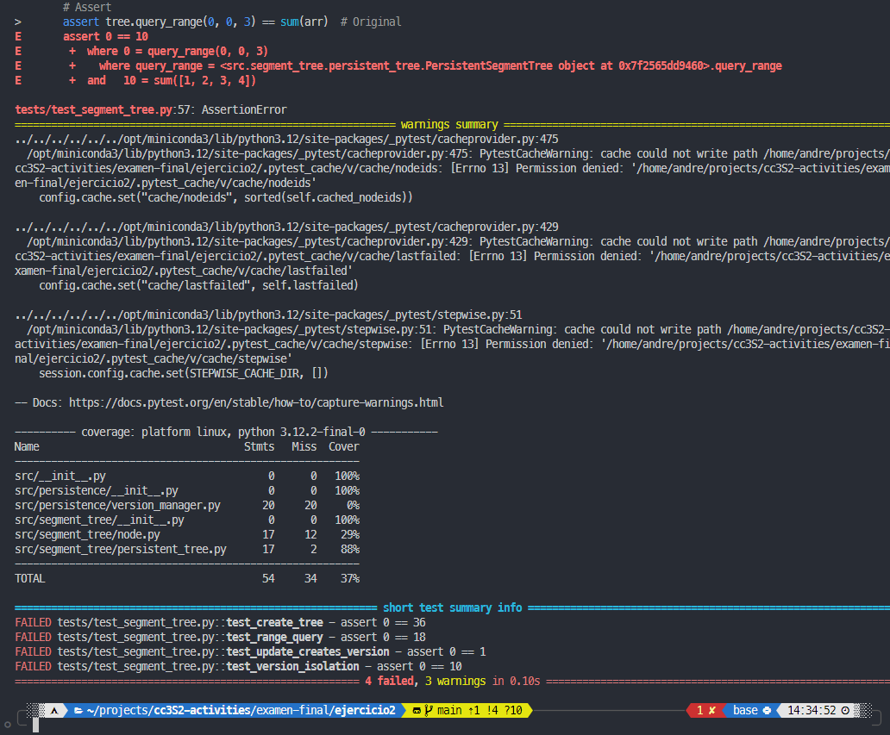
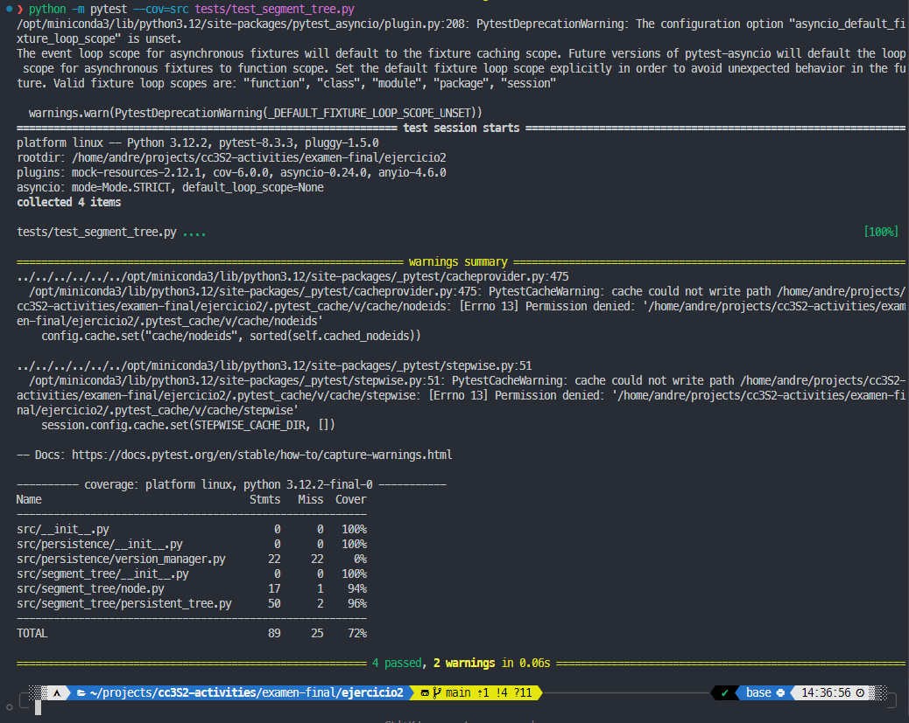
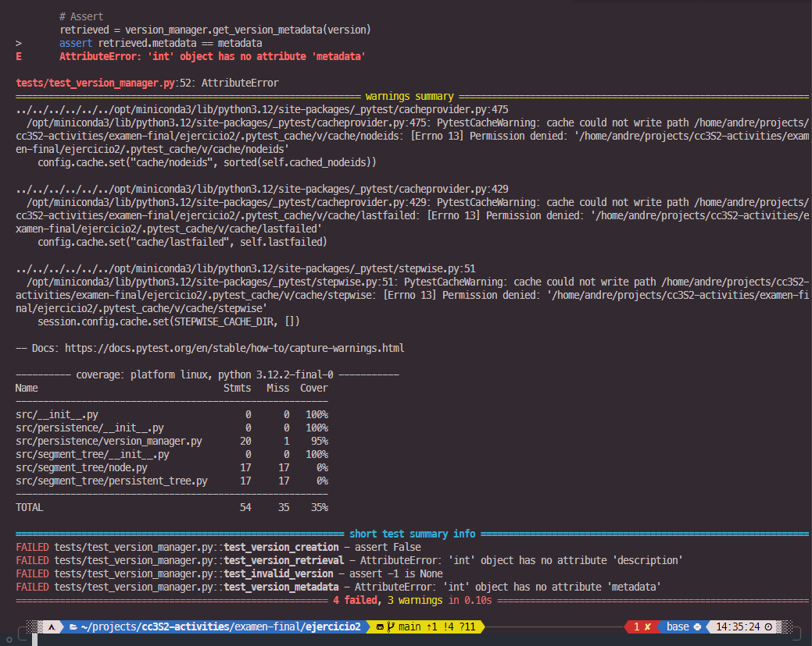
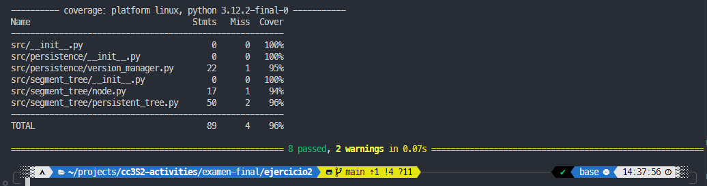
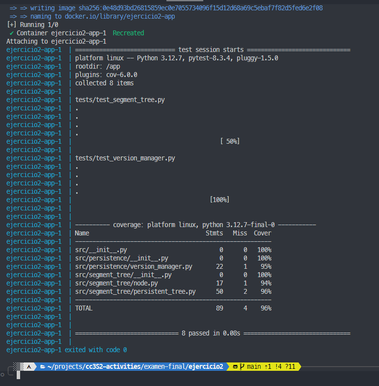

# Ejercicio 2: Árbol de Segmentos Multi-Versión

Implementación de una estructura de datos persistente basada en un árbol de segmentos que permite versionado histórico. Esta estructura combina las ventajas de los árboles de segmentos para consultas de rango con la capacidad de mantener múltiples versiones del árbol.


## Estructura del Proyecto

```bash
ejercicio2/
├── Dockerfile
├── images/              # Imágenes de la documentación
├── README.md            # Documentación
├── requirements.txt     # Dependencias
├── src/
│   ├── __init__.py
│   ├── segment_tree/    # Implementación del árbol
│   │   ├── __init__.py
│   │   ├── node.py
│   │   └── persistent_tree.py
│   └── persistence/     # Manejo de versiones
│       ├── __init__.py
│       └── version_manager.py
└── tests/               # Tests
    ├── __init__.py
    ├── test_segment_tree.py
    └── test_version_manager.py
```

## Ejecución de Tests (Metodología TDD)

### [test_segment_tree.py](tests/test_segment_tree.py):

#### Red
Creé los siguientes tests:
1. test_create_tree: Verifica la creación correcta del árbol base (versión 0)
2. test_range_query: Prueba consultas de rango en la versión inicial
3. test_update_creates_version: Verifica que las actualizaciones crean nuevas versiones
4. test_version_isolation: Comprueba que los cambios no afectan versiones anteriores



Fallan todos, como se esperaba.

#### Green
Después de implementar el árbol de segmentos persistente:



### [test_version_manager.py](tests/test_version_manager.py)

Creé los siguientes tests:
1. test_version_creation: Verifica la creación de nuevas versiones
2. test_version_retrieval: Prueba la recuperación de versiones anteriores
3. test_invalid_version: Verifica el manejo de versiones inválidas
4. test_version_metadata: Prueba el almacenamiento de metadatos de versión

#### Red


#### Green


#### Coverage

Ejecutar tests con cobertura:
```bash
python -m pytest --cov=src tests/
```



Como se observa en la imagen, alcancé una cobertura superior al 90% para todos los módulos.

## Uso con Docker

El archivo es [Dockerfile](Dockerfile)

Pasos para ejecutar el contenedor:

1. Construir la imagen:
```bash
docker build -t segment-tree .
```

2. Ejecutar el contenedor:
```bash
docker run segment-tree
```

También se puede usar el archivo docker compose que está en el directorio [compose.yml](compose.yml), que ejecuta los tests y genera el reporte de cobertura:
```bash
docker compose up --build
```


