# Ejercicio 3: Configuración de Entorno y Fundamentos de Contenedores


## 1. Configuración del Entorno de Desarrollo y fundamentos de contenedores

Considere que estoy usando Arch Linux en WSL2.

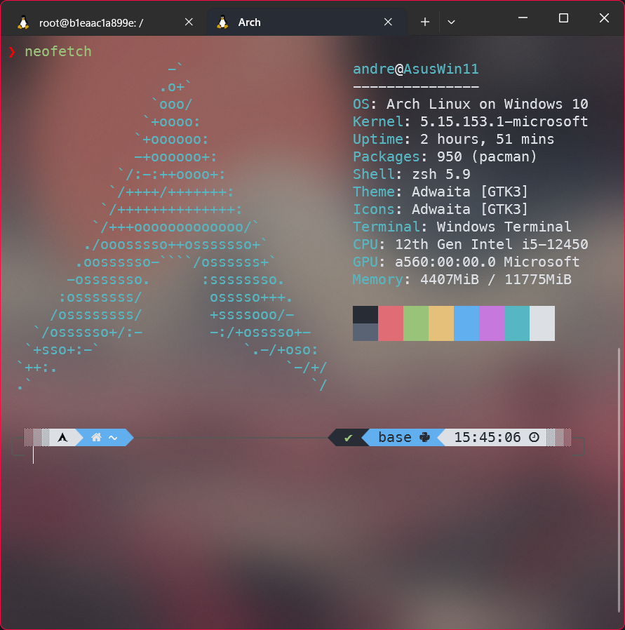

Como pueden ver, mi usuario es andre y estoy en la terminal de windows. Mi configuración de terminal (zsh) con powerlevel10k mantiene el bar minimalista, por lo que no podrá observar el usuario; sin embargo, considero que mi terminal es distinguible a la de otros estudiantes.

Hay una que otra captura que hice desde la terminal de VSCode:

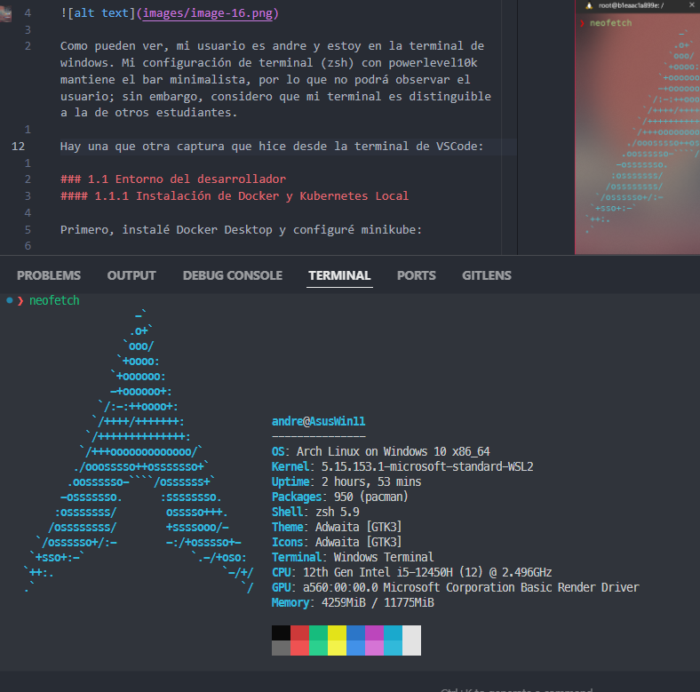

### 1.1 Entorno del desarrollador
#### 1.1.1 Instalación de Docker y Kubernetes Local

Primero, instalé Docker Desktop y configuré minikube:

```bash
# Docker:
sudo pacman -S docker

# Iniciar el servicio de Docker
sudo systemctl start docker

# Habilitar el servicio de Docker al iniciar el sistema
sudo systemctl enable docker

# Minikube:
sudo pacman -S minikube
```

Como observación, considere que ya tenía instalado las dependencias de docker y minikube, por lo que no tuve que instalar nada; solo actualicé los paquetes.

Docker:
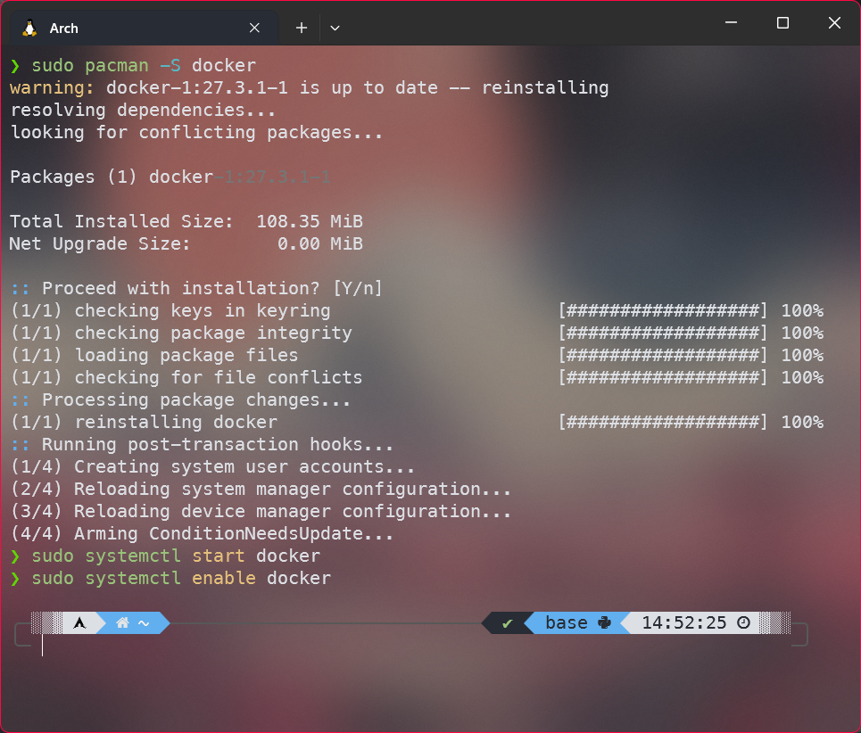

Minikube:
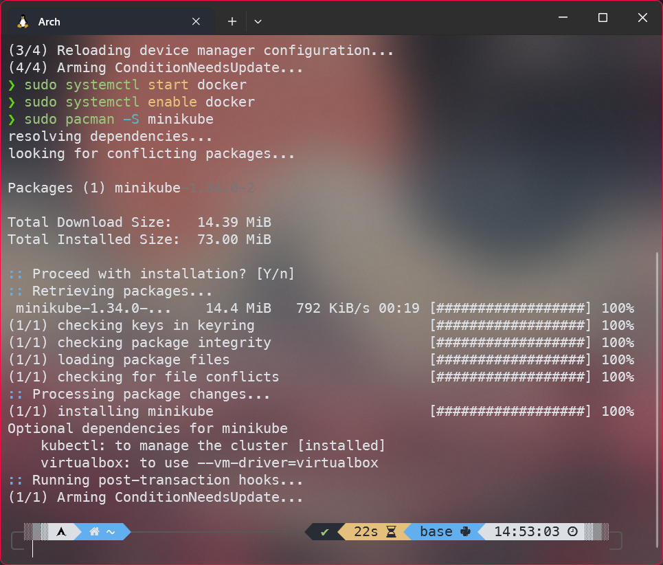

#### 1.1.2 Estructura del Proyecto

Organicé mi proyecto con la estructura mencionada:

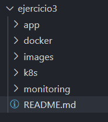

### 1.2 Uso Básico de Docker

#### 1.2.1 Primeros Pasos con Docker

Verifico la versión de docker:
```bash
docker --version
```


Ejecuto un contenedor:

```bash
docker run hello-world
```
Ojo que este contenedor ya lo tengo instalado, por lo que no se muestra el mensaje de instalación.

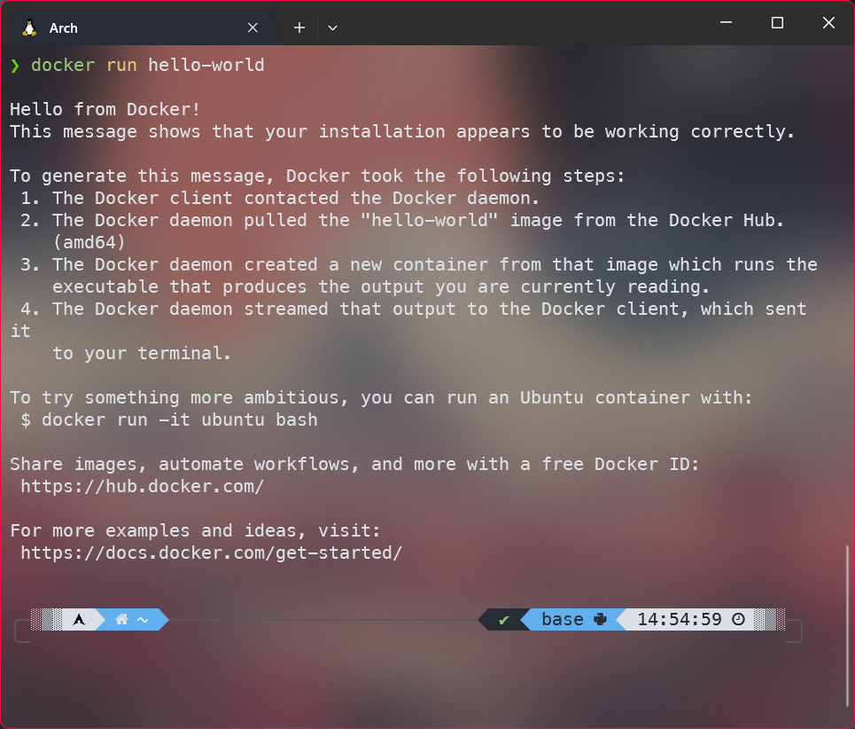

Listo los contenedores:

```bash
docker ps -a
```

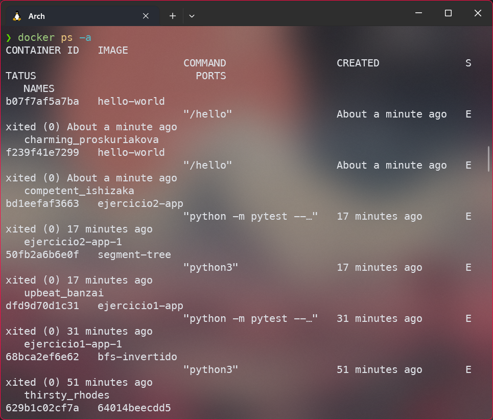

Podemos observar los contenedores de los dos ejercicios anteriores.

También ejecuté docker ps, para ver los contenedores en ejecución; pero no hay ninguno. Esto es porque, según el ciclo de vida de los contenedores, estos se eliminan cuando se termina la ejecución de la aplicación, en el caso de los dos contenedores del ejercicio 1 y 2, se eliminaron al terminar la ejecución de la aplicación.

Esto también se puede ver el los logs de docker:

```bash
docker logs ejercicio2-app
```

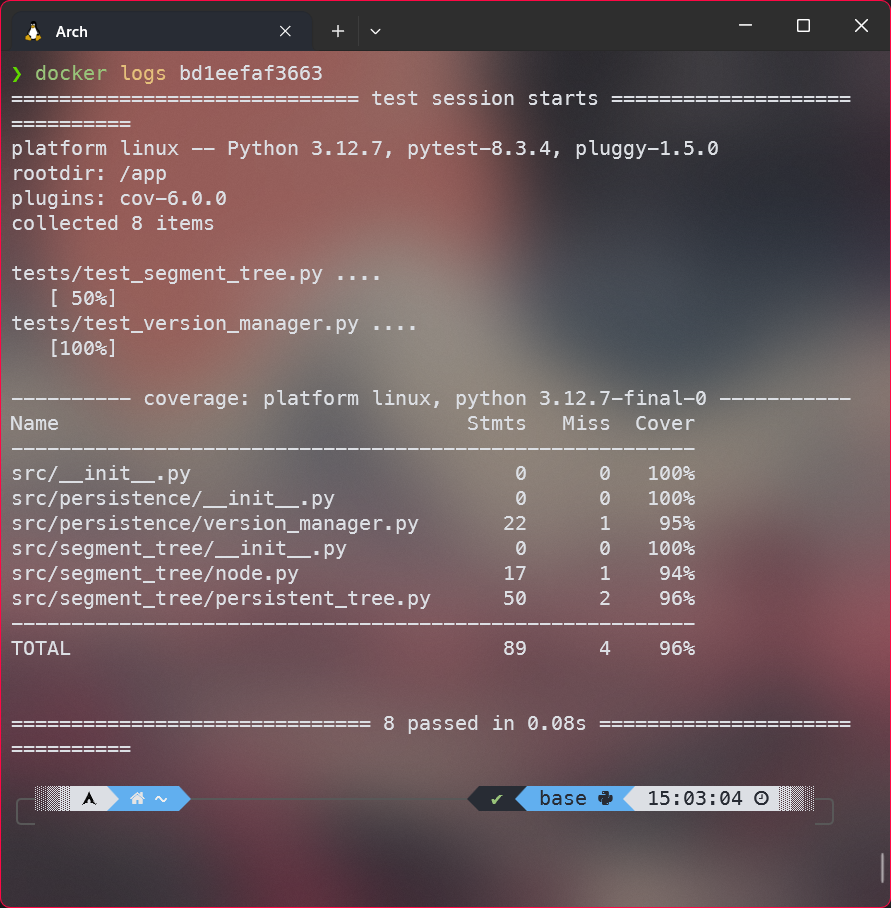

Para poder usar el docker exec necesito un contenedor en ejecución, pero los proyectos anteriores mueren al segundo de ser creados, por lo que no puedo usar el docker exec.


#### 1.2.2 Exploración de Contenedores

Practiqué la exploración de contenedores:

Ejecuto un contenedor interactivo:
```bash
docker run -it ubuntu bash
```
Observación: Tuve que instalar el contenedor ubuntu, ya que no lo tenía instalado.

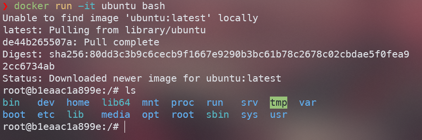

Exploro el sistema de archivos:
```bash
ls -la /
env
```

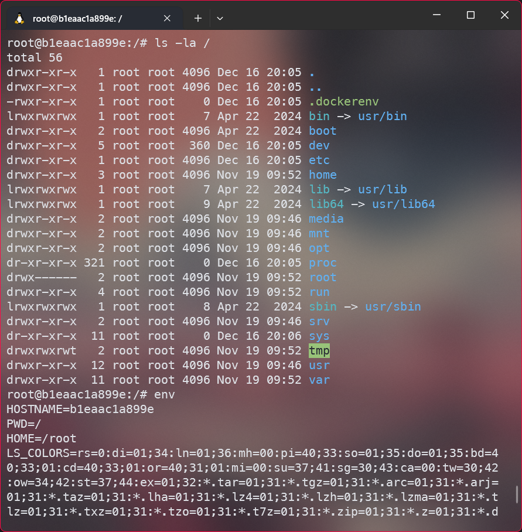

## 2. Construcción de Imágenes Docker

### 2.1 Dockerfile Base

Creé el siguiente [Dockerfile](docker/Dockerfile):

```dockerfile
FROM alpine:3.14
WORKDIR /app
COPY . .
CMD ["echo", "¡Hola profe! Este es el ejercicio 3"]
```

#### 2.1.1 Construcción y Ejecución

Construí la imagen Docker:

```bash
docker build -t ejercicio3-app ./docker
```

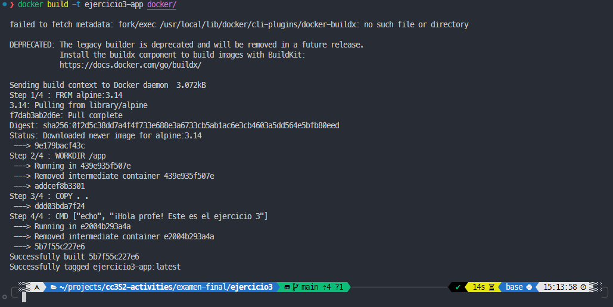

Ejecuté el contenedor:

```bash
docker run --name ejercicio3-container ejercicio3-app
```

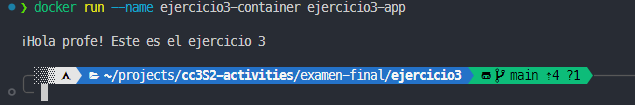

#### 2.2 Instalación de dependencias
Le agregue el siguiente comando al Dockerfile, también incluí neofetch para que se vea bonito:

```dockerfile
RUN apk add --no-cache curl neofetch
```

El dockerfile quedó así:

```dockerfile
FROM alpine:3.14
WORKDIR /app
COPY . .
RUN apk add --no-cache curl neofetch
CMD ["neofetch", "&&", "echo", "¡Hola profe! Este es el ejercicio 3"]
```

Luego de volver a construir la imagen y remover el contenedor de la imagen anterior, se puede ver que se instalaron las dependencias correctamente y el neofetch se ejecuta correctamente.

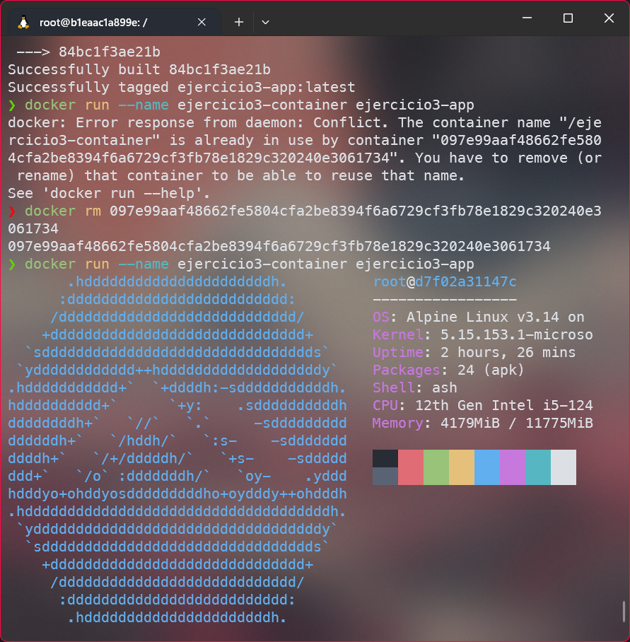
### 2.3 Multi-stage Build

Actualicé el Dockerfile para implementar un multi-stage build:

```dockerfile
# Stage 1: Build
FROM alpine:3.14 AS builder
WORKDIR /build
COPY . .
RUN apk add --no-cache curl neofetch

# Stage 2: Production
FROM alpine:3.14
WORKDIR /app
COPY --from=builder /build/. .
CMD ["echo", "Este contenedor está mejor optimizado"]
```

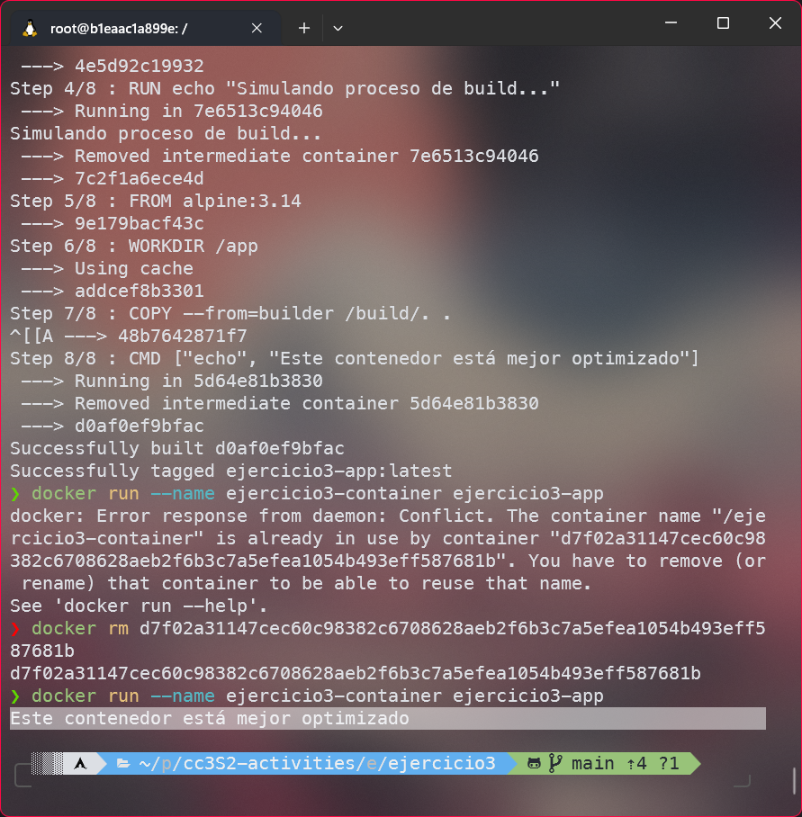

### 2.4 Compilación y etiquetado

#### 2.4.1 Construcción y etiquetado de la imagen para Docker Hub

1. Primero, me aseguro de estar autenticado en Docker Hub:
```bash
docker login
```

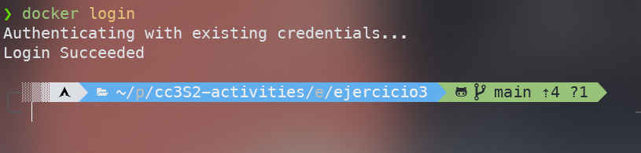

2. Construyo la imagen con mi usuario de Docker Hub:
```bash
docker build -t apachecot/ejercicio3-app:v1.0.0 ./docker
```

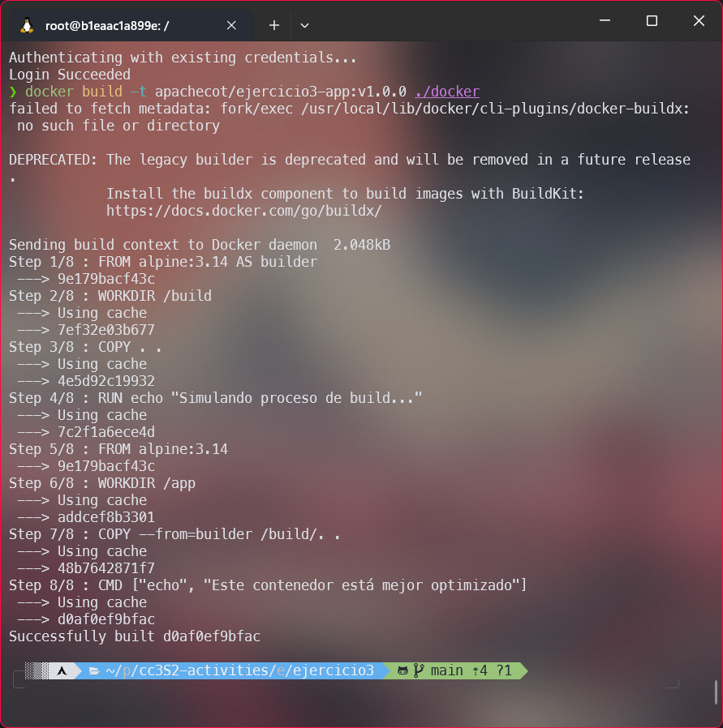

3. También creo una etiqueta "latest":
```bash
docker tag apachecot/ejercicio3-app:v1.0.0 apachecot/ejercicio3-app:latest
```

#### 2.4.2 Subida al Docker Hub

Subo ambas versiones al registro:
```bash
docker push apachecot/ejercicio3-app:v1.0.0
docker push apachecot/ejercicio3-app:latest
```

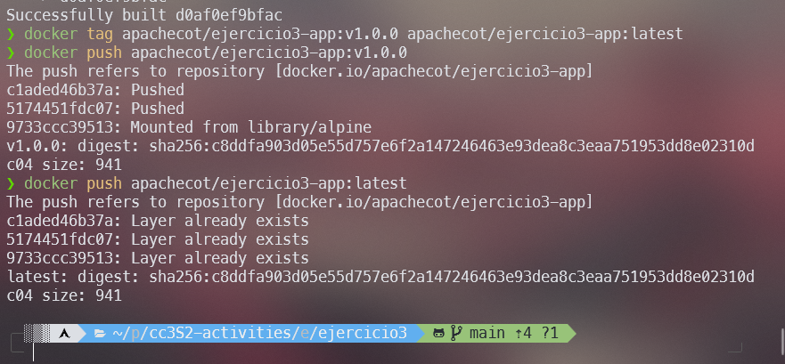

Pueden ver la imagen en el siguiente enlace:
https://hub.docker.com/r/apachecot/ejercicio3-app

Lo bueno es que ahora para que otros puedan usar la imagen, solo necesitan ejecutar:
```bash
docker pull apachecot/ejercicio3-app:latest
```

## 3. Containerizar la aplicación de servidor y depuración

### 3.0 Creando aplicación de servidor
Hasta hora no he creado una aplicación de servidor, por lo que no hay puertos expuestos ni nada que hacer; por ende no podría proceder con la actividad 3.

Por ello lo que haré será crear una aplicación de servidor con FastAPI y Python que se ejecute en el puerto 8080 y que se pueda acceder a través de curl.
La aplicación solo tendrá un endpoint que retorne un mensaje de saludo y un endpoint de healthcheck que retorne un estado 200.

Creo el archivo [main.py](app/main.py) con el siguiente contenido:

```python
from fastapi import FastAPI

app = FastAPI()

@app.get("/")
def root():
    return {"message": "¡Hola profe! Este es el ejercicio 3"}

@app.get("/health")
def health_check():
    return {"status": "ok"}
```

Luego creo requirements.txt con el siguiente contenido:

```
fastapi
uvicorn
```

Ahora tengo que actualizar el Dockerfile para que instale python y pip, y luego instale las dependencias del requirements.txt. Para ello lo edité de la siguiente manera:

```dockerfile
# Stage 1: Build
FROM alpine:3.14 AS builder
WORKDIR /build
# Copiamos el archivo requirements.txt
COPY ../app/requirements.txt .
# Instalamos dependencias
RUN apk add --no-cache python3 py3-pip
RUN pip install -r requirements.txt

# Copiamos el resto de la aplicación
COPY ../app .
RUN echo "Build finalizado"

# Stage 2: Production (Optimizado)
FROM alpine:3.14
WORKDIR /app
# Instalamos python, pip y curl
RUN apk add --no-cache python3 py3-pip curl
# Copiamos las dependencias de python
COPY --from=builder /usr/lib/python3.9/site-packages/ /usr/lib/python3.9/site-packages/
# Copiamos el resto de la aplicación
COPY --from=builder /build .
# Corremos la aplicación
CMD ["python3", "-m", "uvicorn", "main:app", "--host", "0.0.0.0", "--port", "8080"]
```

### 3.1 Containerización del servidor

Actualicé el compose.yml para incluir la configuración del servidor y que corra la aplicación de FastAPI:

```yaml
services:
  app:
    build:
      context: .
      dockerfile: docker/Dockerfile
    ports:
      - "8080:8080"
    environment:
      - ENV=development
      - PORT=8080
    healthcheck:
      test: ["CMD", "curl", "-f", "http://localhost:8080/health"]
      interval: 30s
      timeout: 10s
      retries: 3
    volumes:
      - ./app:/app
    command: ["python", "-m", "uvicorn", "main:app", "--host", "0.0.0.0", "--port", "8080"]

```
Observación: Estoy creando un compose.yml porque en la versión V2 de docker compose, el comando es docker compose y el nombre del archivo pasa a ser prioritariamente compose.yml. No es que deje de funcionar con docker-compose.yml, pero es la mejor práctica.
Este docker compose cumple con parte delos requerimientos del ejercicio 4. Está pendiente los servicios de base de datos o cola.

### 3.2 Pruebas locales y debugging

#### 3.2.1 Lanzamiento y monitoreo

Lancé el contenedor y revisé los logs:

```bash
docker compose up --build
docker compose logs -f
```

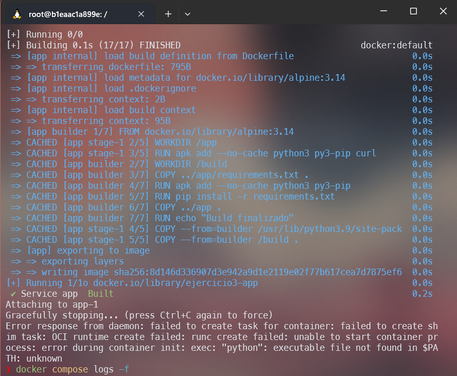

Tuve problemas con el contenedor. No pude acceder a él, por lo que no pude probar la conectividad.

De resolverse, podría probar la conectividad con el siguiente comando:
```bash
docker exec -it ejercicio3-app sh
```

Dentro del contenedor, podría probar la conectividad con el siguiente comando:
```bash
curl localhost:8080
```

## 4. Usar Docker Compose para pruebas locales
Los requerimientos del ejercicio 4 se puede ver en el [compose.yml](compose.yml). Para agregar una base de datos usaré Redis y se tiene que agregar las siguientes líneas al compose.yml:

```yaml
services:
  redis:
    image: redis:latest
    ports:
      - "6379:6379"
```
Utilicé Redis porque es popular, fácil de usar y no requiere configuración. Además que tengo experiencia con él en el trabajo.