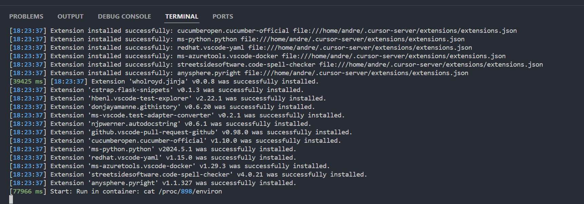
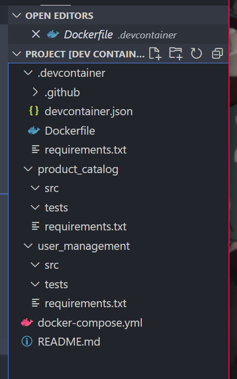
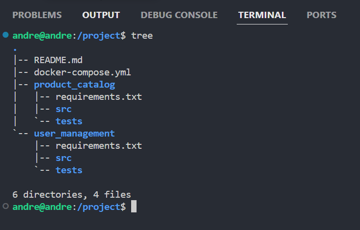
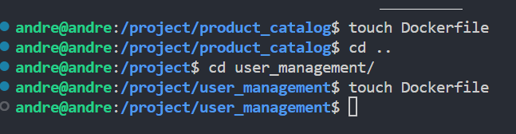
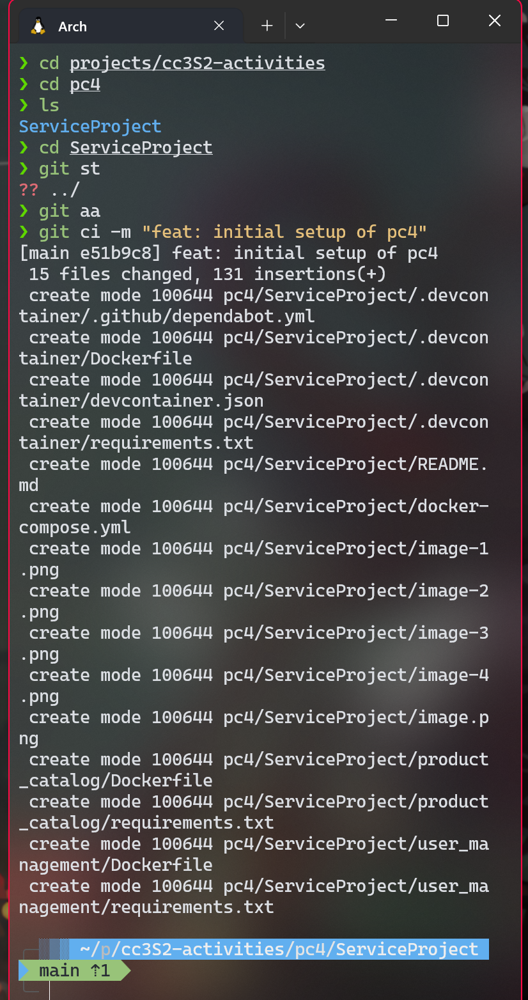
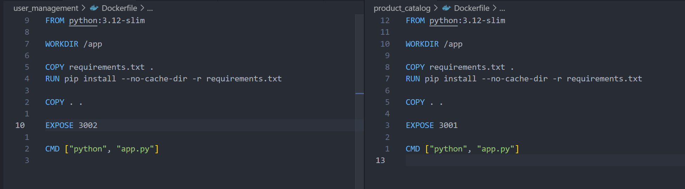
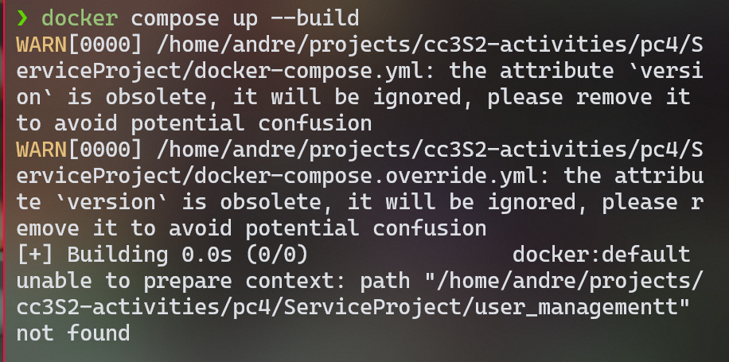
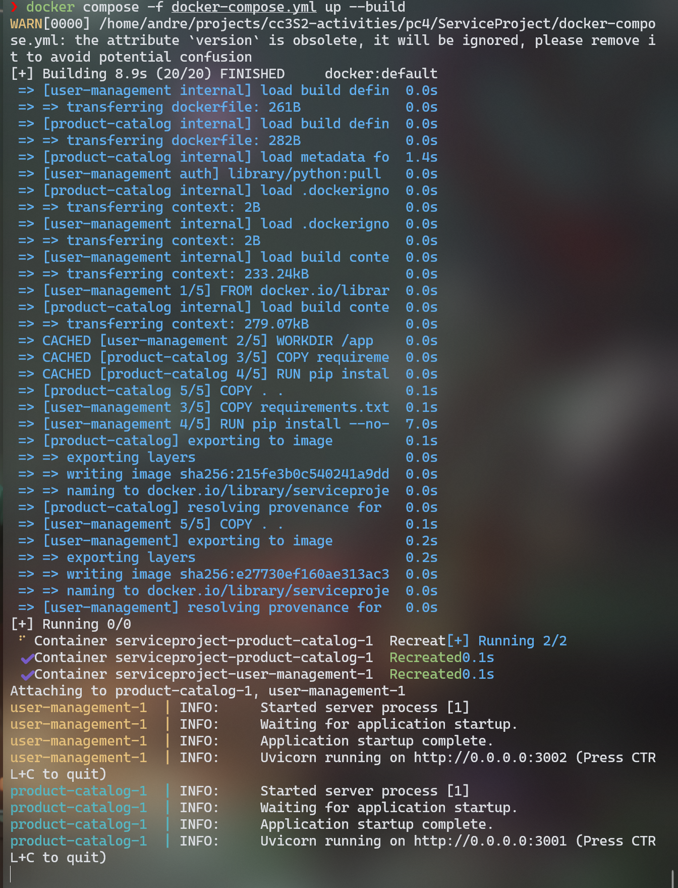

# Práctica Calificada 4
André Pacheco - 20222189G


## Entrando a la carpeta del proyecto con el devcontainer
Se usó el devcontainer del laboratorio pasado
Instalando


ya dentro del devcontainer


## Creando estructura de archivos






## Creando contenedores

Creo 1 contenedor por cada servicio



Como estamos dentro de un repositorio de github, en lugar de crear uno nuevo, voy a empezar a commitear usando conventional commits.
```
git add .
git commit -m "feat: initial setup of pc4"
```

Sin embargo dentro del devcontainer no se puede commitear directamente, pues no encuentra la carpeta .git; por ello comiteo desde la terminal del host.



Nota: mis áliases principales para git que usé son:
```
alias st="git status"
alias aa="git add ."
alias ci="git commit -m"
```

Observación: las imágenes del readme se tendrán que refactorizar para que estén en una sola carpeta images/
Esto ser hará al finalizar el desarrollo de los proyectos.


## Docker
Lo concerniente a docker estará en este archivo.

Creo también docker-compose.override.yml para simular los fallos entre red.

Opté usar por defecto python:3.12-slim para los contenedores, ya que es la versión más reciente y de ser ligera.

Para product_catalog expuse el puerto 3001 y para user_management expuse el puerto 3002.



Ojo: de momento no estoy ejecutando los tests. Lo haré cuando se implementen.


Cuando se usa el docker-compose.override.yml, se ve que hay errores cuando cambias las rutas y no deja levantar los contenedores.


Por otro lado, cuando se usa el docker-compose.yml, no hay errores.



## Empezamos con los proyectos
A partir de ahora, cada proyecto tiene su propio NOTES.md; que detallará cómo usé SOLID en cada módulo.

No tuve errores en ninguno de los proyectos y cumplí con los tests; pero no tuve tiempo de resolver las preguntas.