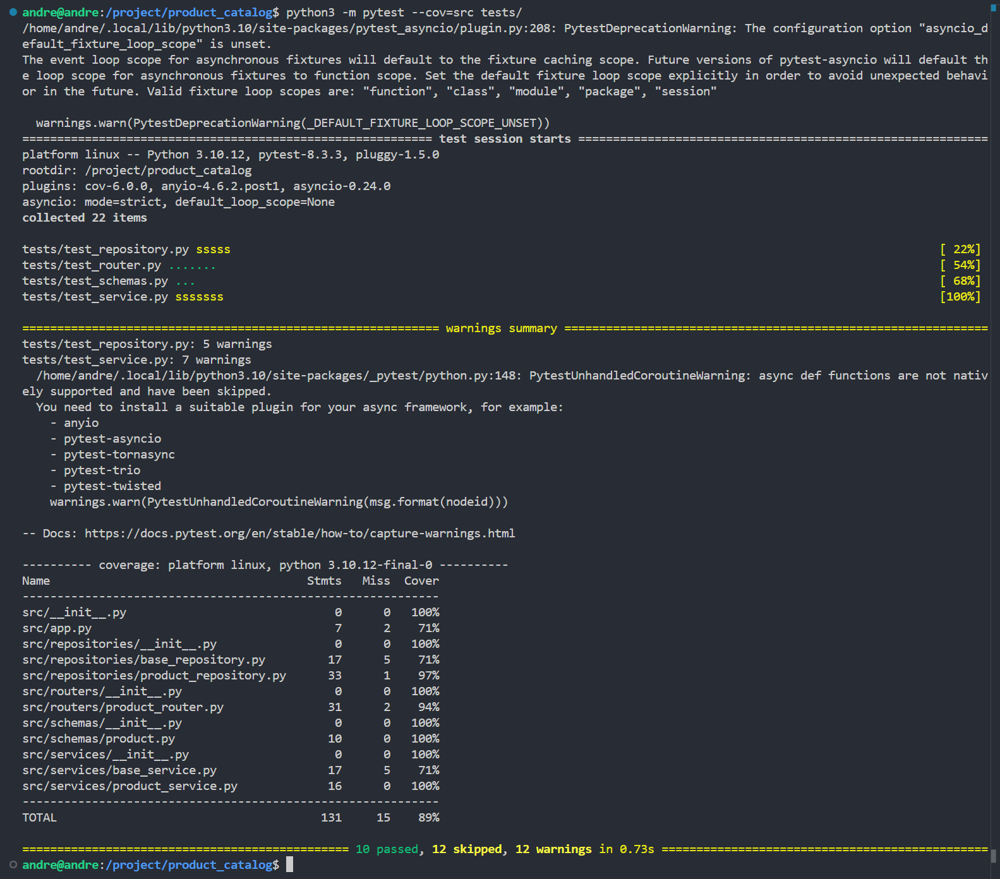

# Catálogo de Productos - Principios SOLID

## Single Responsibility Principle
Separación clara de responsabilidades por carpetas:
- `routers/product_router.py` - Solo maneja rutas HTTP y endpoints
- `schemas/product.py` - Define la estructura de datos del producto
- `services/product_service.py` - Implementa la lógica de negocio
- `repositories/product_repository.py` - Maneja el acceso a datos

## Open/Closed Principle
- `base_repository.py` define una clase abstracta que permite extender nuevas implementaciones
- `base_service.py` proporciona una base para crear nuevos servicios sin modificar el código existente
- Los servicios heredan de BaseService para implementar operaciones específicas

## Liskov Substitution Principle
- `product_repository.py` hereda de BaseRepository manteniendo el contrato
- Las pruebas en `test_repository.py` validan que las implementaciones son intercambiables

## Interface Segregation Principle
- BaseRepository define los métodos CRUD
- ProductService implementa solo los métodos necesarios para productos
- Schemas separados por entidad evitan dependencias innecesarias

## Dependency Inversion Principle
Ejemplo concreto en ProductService:
```python
class ProductService(BaseService):
    def __init__(self, repository: BaseRepository):
        self.repository = repository
```
- El servicio depende de la abstracción (BaseRepository)
- Permite inyectar cualquier repositorio que implemente BaseRepository
- Facilita testing al poder inyectar un mock repository

## Estructura de Pruebas
- `test_repository.py` - Pruebas de acceso a datos
- `test_router.py` - Pruebas de endpoints HTTP
- `test_schemas.py` - Validación de modelos de datos
- `test_service.py` - Pruebas de lógica de negocio

## Métricas de Pruebas
- Cobertura: 89% (116/131 declaraciones)
- 22 pruebas totales (10 aprobadas, 12 omitidas)
- Pendiente: Mejorar cobertura en clases base

