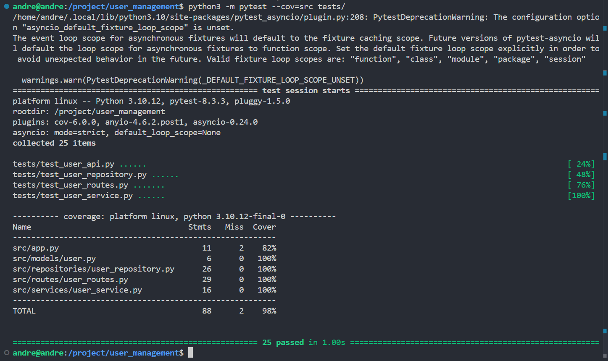

# User Management

## Single Responsibility Principle
Separación clara de responsabilidades por carpetas:
- `models/user.py` - Define la estructura del usuario
- `repositories/user_repository.py` - Maneja el acceso a datos
- `routes/user_routes.py` - Gestiona endpoints HTTP 
- `services/user_service.py` - Implementa lógica de negocio

## Estructura de Pruebas
Organización por capas:
- `test_user_api.py` - Pruebas de integración API
- `test_user_repository.py` - Pruebas de acceso a datos
- `test_user_routes.py` - Pruebas de endpoints
- `test_user_service.py` - Pruebas de lógica de negocio

## Métricas de Cobertura
Resultados del último test (pytest --cov=src tests/):

## Estado de Pruebas
- Total pruebas: 25
- Pruebas pasadas: 25 (100%)
- Tiempo ejecución: 1.00s
- Cobertura global: 98%

